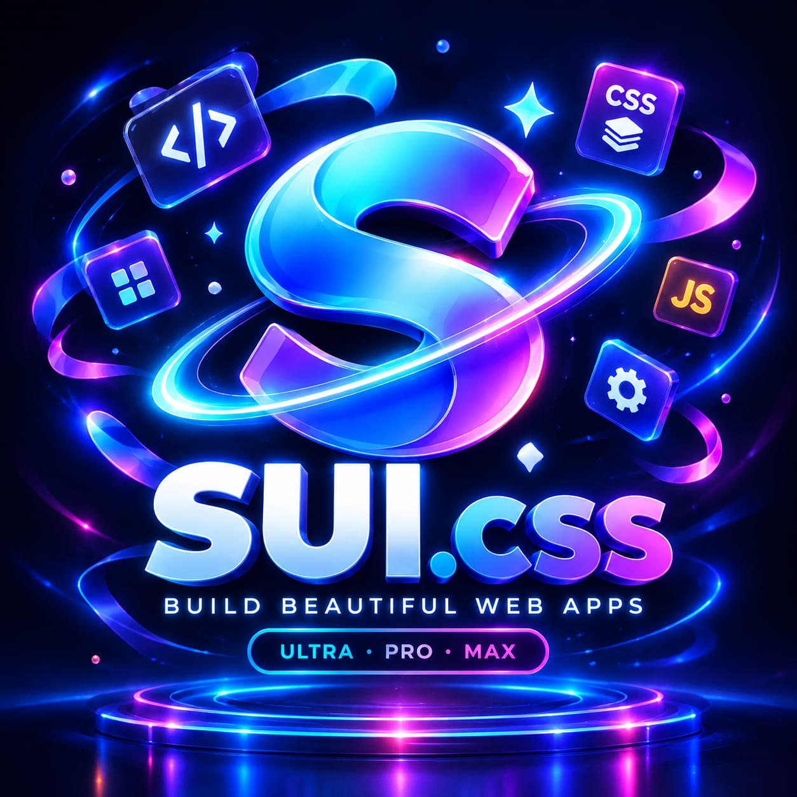

<div align="center">
  
  <h1>Sui.css Architecture</h1>
  <p><strong>The Ultra Pro Max CSS Framework for Premium Web Applications.</strong></p>
  <p>Version 2.0.0 • Built with OKLCH • Zero Dependencies • Hardware Accelerated</p>
</div>

---

## 📖 Comprehensive Table of Contents

1. [System Overview & Philosophy](#1-system-overview--philosophy)
2. [Installation & CDN Setup](#2-installation--cdn-setup)
3. [Design Tokens & Theming (CSS Variables)](#3-design-tokens--theming-css-variables)
4. [Layout Engine (Flex & Subgrid)](#4-layout-engine-flex--subgrid)
5. [Utility Classes (Typography, Spacing, Colors)](#5-utility-classes-typography-spacing-colors)
6. [Relational Component Library](#6-relational-component-library)
7. [Hardware-Accelerated Animation Engine](#7-hardware-accelerated-animation-engine)
8. [JavaScript Core (`sui.min.js`)](#8-javascript-core-suiminjs)
9. [Advanced Theming & Dark Mode](#9-advanced-theming--dark-mode)
10. [Production-Ready Starter Templates](#10-production-ready-starter-templates)
11. [Author & License](#11-author--license)

---

## 1. System Overview & Philosophy

**Sui.css** is an elite, lightweight CSS architecture designed for developers building complex, high-performance web applications. It abandons legacy CSS practices in favor of modern, strictly standard web technologies.

### The Four Pillars of Sui.css:
* **Perceptual OKLCH Engine:** Traditional hex and RGB colors suffer from uneven lightness and muddy gradients. Sui.css is built entirely on the OKLCH color space. By changing a single hue variable, the framework mathematically recalculates perfect contrast, hover states, and dark mode variants instantly.
* **Native CSS Subgrid:** Legacy grid systems require complex nesting and JavaScript calculation to make cards in a row equal height with perfectly aligned footers. Sui.css uses true CSS Subgrid to perfectly align content matrices natively.
* **Hardware-Accelerated Physics:** All animations in Sui.css (springs, blur-reveals, and lifts) are strictly bound to `transform` and `opacity` properties. This forces the browser to utilize the GPU compositor thread, guaranteeing 60fps performance without JavaScript animation libraries.
* **Zero Specificity Wars:** The framework utilizes modern CSS `@layer` architecture to ensure that utilities always override components, and components always override base resets, eliminating the need for `!important`.

---

## 2. Installation & CDN Setup

Sui.css requires absolutely no build tools, Node modules, or PostCSS configurations. Simply include the files in your HTML document.

### Global CDN Implementation (Recommended)

To get started immediately, copy and paste these code blocks into your `index.html` file. 

**1. CSS Core:** Place this link inside your `<head>` tag.
```html
<link rel="stylesheet" href="[https://cdn.jsdelivr.net/gh/Suman-11-web/SUI-FRAMEWORK.CSS@v2.0.0/dist/sui.min.css](https://cdn.jsdelivr.net/gh/Suman-11-web/SUI-FRAMEWORK.CSS@v2.0.0/dist/sui.min.css)">
```

**2. JavaScript Core:** Place this script tag at the very bottom of your document, just before the closing `</body>` tag.
```html
<script src="[https://cdn.jsdelivr.net/gh/Suman-11-web/SUI-FRAMEWORK.CSS@v2.0.0/dist/sui.min.js](https://cdn.jsdelivr.net/gh/Suman-11-web/SUI-FRAMEWORK.CSS@v2.0.0/dist/sui.min.js)"></script>
```

### Local Offline Setup

If you are developing without an internet connection or prefer hosting your own assets:
1. Download the `dist/sui.min.css` and `dist/sui.min.js` files from the repository.
2. Place them in your project's asset directory.
3. Link them relatively:
```html
<link rel="stylesheet" href="./assets/sui.min.css">
<script src="./assets/sui.min.js"></script>
```

---

## 3. Design Tokens & Theming (CSS Variables)

Sui.css uses a powerful semantic token system. All variables are exposed on the `:root` element, allowing for instantaneous global theming.

### Global Brand Tokens
| CSS Variable | Description |
| :--- | :--- |
| `--sui-brand-hue` | The master hue integer (0-360). Default is `250` (Indigo). |
| `--sui-font-sans` | The primary font stack. Defaults to system-ui for maximum performance. |
| `--sui-font-mono` | The monospace stack used for code blocks and data matrices. |

### Semantic Color Tokens
These tokens are generated using the master hue, but can be explicitly overridden in your custom CSS.
* `--sui-color-primary-500`: Used for primary call-to-actions, active links, and focus rings.
* `--sui-color-accent-500`: Used for secondary actions, gradients, and badges.
* `--sui-color-success-500`: Green spectrum for success states, verifications, and positive trends.
* `--sui-color-danger-500`: Red spectrum for destructive actions, errors, and warnings.
* `--sui-color-warning-500`: Yellow spectrum for alerts and pending states.

### Surface & Depth Tokens
Sui.css builds depth using semantic surfaces rather than hardcoded background colors.
* `--sui-bg`: The absolute base layer (applied to `body`).
* `--sui-bg-canvas`: A slightly elevated container layer.
* `--sui-surface`: The primary background for interactive elements like cards and modals.
* `--sui-surface-hover`: A reactive background for hovered rows and interactive ghost buttons.
* `--sui-border`: Standard structural divider lines.
* `--sui-border-strong`: High-contrast borders used for focused inputs.

### The Radius Scale
* `--sui-radius-sm`: 4px (Checkboxes, small tags)
* `--sui-radius-md`: 8px (Inputs, buttons)
* `--sui-radius-lg`: 12px (Cards, dropdowns)
* `--sui-radius-xl`: 16px (Modals, hero sections)
* `--sui-radius-full`: 9999px (Pill buttons, avatars)

---

## 4. Layout Engine (Flex & Subgrid)

The layout engine removes the need to write custom media queries by providing fluid grid and flexbox utilities.

### Flexbox Architecture
Flex utilities are perfect for alignment and 1-dimensional layouts.
* `.sui-flex`: Initializes a flexbox container.
* `.sui-flex-col`: Stacks children vertically.
* `.sui-flex-row`: Aligns children horizontally.
* `.sui-flex-wrap`: Allows children to wrap to a new line if space runs out.
* `.sui-flex-1`: Commands a child to consume all remaining available space.
* `.sui-items-center`: Aligns items perfectly in the vertical center.
* `.sui-justify-between`: Pushes the first item to the left edge and the last to the right edge.

### Advanced Grid & Subgrid
Grid utilities are designed for complex page scaffolds and data layouts.
* `.sui-grid`: Initializes the grid container.
* `.sui-grid-cols-1` to `.sui-grid-cols-12`: Forces a strict number of equal-width columns.
* `.sui-gap-1` to `.sui-gap-12`: Applies mathematically perfect spacing between grid/flex items without margin collapse.

**Responsive Modifiers:**
Prefix any layout class to apply it only at a specific breakpoint.
* `md:` (Tablets and larger, >768px)
* `lg:` (Desktops and larger, >1024px)

```html
<!-- Example: A layout that is stacked on mobile, but splits into 3 columns on desktop -->
<div class="sui-grid sui-grid-cols-1 md:sui-grid-cols-3 sui-gap-6">
  <div class="sui-p-6 sui-bg-surface sui-rounded-lg">Column 1</div>
  <div class="sui-p-6 sui-bg-surface sui-rounded-lg">Column 2</div>
  <div class="sui-p-6 sui-bg-surface sui-rounded-lg">Column 3</div>
</div>
```

---

## 5. Utility Classes (Typography, Spacing, Colors)

Utilities let you style elements at a granular level directly in your HTML.

### Typography Scale
* Sizes: `.sui-text-xs`, `.sui-text-sm`, `.sui-text-base`, `.sui-text-lg`, `.sui-text-xl`, `.sui-text-2xl`, `.sui-text-3xl`, `.sui-text-4xl`, `.sui-text-hero`.
* Weights: `.sui-font-normal`, `.sui-font-medium`, `.sui-font-bold`, `.sui-font-black`.
* Alignment: `.sui-text-left`, `.sui-text-center`, `.sui-text-right`.

### Text Colors
* `.sui-text`: Standard high-contrast text color.
* `.sui-text-muted`: Lower contrast text for secondary information.
* `.sui-text-inverse`: Guaranteed contrast on dark colored backgrounds.
* `.sui-text-primary`: Text colored with the master brand hue.

### Margin & Padding System
Classes use the standard format: `[property][direction]-[size]`.
* Properties: `p` (padding), `m` (margin).
* Directions: `t` (top), `b` (bottom), `l` (left), `r` (right), `x` (horizontal), `y` (vertical), or blank for all sides.
* Example: `.sui-px-6` (padding left & right scale 6), `.sui-mt-4` (margin top scale 4), `.sui-p-8` (padding all sides scale 8).

---

## 6. Relational Component Library

Components in Sui.css are "smart." Using modern CSS `:has()` pseudo-selectors, components analyze their internal DOM tree and adjust their styles dynamically.

### Premium Buttons
Buttons include precise focus rings, hover transitions, and active hardware-compression states.
* Base class: `.sui-btn` (Required on all buttons).
* Variants: `.sui-btn-primary`, `.sui-btn-secondary`, `.sui-btn-outline`, `.sui-btn-ghost`, `.sui-btn-danger`.
* Modifiers: `.sui-btn-sm`, `.sui-btn-lg`, `.sui-btn-icon` (perfectly squares the button for SVGs).

```html
<!-- Example of a standard primary button -->
<button class="sui-btn sui-btn-primary sui-active-push">
  Submit Data
</button>
```

### Intelligent Cards
Cards are the foundational block for data display.
* `.sui-card`: Applies background, padding, border radius, and premium box-shadows automatically.
* Relational Logic: If a card contains a `.sui-btn-primary`, the card will elevate its box-shadow and slightly illuminate its border on hover automatically.

```html
<article class="sui-card sui-hover-lift">
  <h3 class="sui-text-xl sui-mb-2">API Documentation</h3>
  <p class="sui-text-muted sui-mb-6">Integrate your application seamlessly.</p>
  <button class="sui-btn sui-btn-outline sui-w-full">Read Docs</button>
</article>
```

### Advanced Form Controls
Form inputs are notoriously difficult to normalize. Sui.css handles them flawlessly.
* `.sui-input`: Applies to inputs, textareas, and selects. Provides OKLCH focus rings and hover states.
* `.sui-label`: Provides perfect spacing and font-weight for input labels.
* `.sui-form-group`: Perfectly spaces a label and its corresponding input.

```html
<div class="sui-form-group">
  <label class="sui-label">Full Name</label>
  <input class="sui-input" type="text" placeholder="John Doe">
</div>
```

### Badges & Avatars
* `.sui-badge`: Small pill-shaped indicators (`.sui-badge-success`, `.sui-badge-warning`, etc.).
* `.sui-avatar`: A mathematically perfect circle that automatically centers text initials or masks an image cleanly.

---

## 7. Hardware-Accelerated Animation Engine

Sui.css bypasses the CPU for animation rendering, strictly commanding the GPU via transform rules to ensure buttery-smooth 60fps physics.

### Load State Entry Animations
Apply these classes to elements so they choreograph beautifully when the page loads.
* `.sui-animate-blur-in`: Fades from opacity 0 to 1 while resolving a 10px CSS blur.
* `.sui-animate-slide-up`: Translates 20px upward while fading in.
* `.sui-animate-spring-up`: Uses a custom cubic-bezier to shoot slightly past its target destination and bounce back softly.

### Interactive Micro-Animations
* `.sui-hover-lift`: Scales the element to 1.02x on hover and deepens the shadow.
* `.sui-active-push`: Scales the element down to 0.95x on click/tap, mimicking a physical button press.
* `.sui-hover-glow`: Emits a soft, colored OKLCH radial shadow on hover.

### Looping Motion
* `.sui-animate-pulse-glow`: Emits a continuous, expanding radar ring (ideal for live recording indicators).
* `.sui-animate-float`: Smoothly levitates the element on the Y-axis continuously.

---

## 8. JavaScript Core (`sui.min.js`)

Sui.css provides a highly optimized, zero-dependency JavaScript file to handle states that CSS cannot manage alone. It uses modern event delegation and does not manipulate the Virtual DOM.

### 1. The Mobile Drawer Controller
Handles the off-canvas navigation overlay.
* **Trigger:** Add `id="mobileMenuBtn"` to your hamburger menu icon.
* **Target:** The JS looks for an element with `id="mobileDrawer"` and applies the `.is-open` animation state.
* **Dismissal:** Adding the `.js-drawer-close` class to any button or background overlay will strip the `.is-open` state and close the drawer cleanly.

### 2. Live Documentation Syntax Engine
Built directly into the core is a lightweight Regex parser that highlights code blocks for documentation sites without requiring heavy libraries like CodeMirror.
* It intercepts raw HTML inside `<textarea>` elements, escapes dangerous tags, and renders a perfectly colored syntax view utilizing your OKLCH design tokens.

### 3. Scroll Sync Architecture
To enable editable code playgrounds in documentation, the JS seamlessly syncs the `scrollTop` and `scrollLeft` properties of the invisible typing layer with the underlying colored syntax layer.

---

## 9. Advanced Theming & Dark Mode

Sui.css does not require recompilation to change its core aesthetics. 

### Overriding Global Architecture
To change the entire look of the framework, simply create a `styles.css` file, load it directly beneath the CDN link, and redeclare the `:root` variables.

```css
/* Your custom styles.css */
:root {
  /* Change brand color to Emerald Green */
  --sui-brand-hue: 150;
  
  /* Create a brutalist, sharp UI by removing border radius */
  --sui-radius-sm: 0px;
  --sui-radius-md: 0px;
  --sui-radius-lg: 0px;
  --sui-radius-xl: 0px;
  --sui-radius-full: 0px;
}
```

### Semantic Dark Mode Implementation
Sui.css utilizes attribute-based theming. To trigger a dark theme, target the `data-theme` attribute on the root HTML tag.

```css
/* Implementing a custom dark theme */
html[data-theme="dark"] {
  --sui-bg: #09090b;
  --sui-bg-canvas: #18181b;
  --sui-surface: #27272a;
  --sui-surface-hover: #3f3f46;
  --sui-text: #fafafa;
  --sui-text-muted: #a1a1aa;
  --sui-border: #3f3f46;
}
```

---

## 10. Production-Ready Starter Templates

Copy these fully structured HTML templates to kickstart your next project instantly.

### Template 1: The High-Conversion Landing Page
Features fluid layout, interactive buttons, and choreographed entry animations.

```html
<!DOCTYPE html>
<html lang="en">
<head>
  <meta charset="UTF-8">
  <meta name="viewport" content="width=device-width, initial-scale=1.0">
  <title>Premium Software Launch - Sui.css</title>
  <link rel="stylesheet" href="[https://cdn.jsdelivr.net/gh/Suman-11-web/SUI-FRAMEWORK.CSS@v2.0.0/dist/sui.min.css](https://cdn.jsdelivr.net/gh/Suman-11-web/SUI-FRAMEWORK.CSS@v2.0.0/dist/sui.min.css)">
</head>
<body class="sui-bg">

  <!-- Fixed Navigation Bar -->
  <nav class="sui-flex sui-items-center sui-justify-between sui-p-6 sui-border-b sui-border-subtle sui-bg-surface">
    <strong class="sui-text-xl sui-font-black">Platform.</strong>
    <div class="sui-flex sui-gap-6 sui-items-center">
      <a href="#" class="sui-text-muted sui-font-medium hover:sui-text-primary">Products</a>
      <a href="#" class="sui-text-muted sui-font-medium hover:sui-text-primary">Pricing</a>
      <button class="sui-btn sui-btn-sm sui-btn-primary">Dashboard</button>
    </div>
  </nav>

  <!-- Hero Section -->
  <main class="sui-flex sui-flex-col sui-items-center sui-justify-center sui-text-center sui-px-6 sui-py-24">
    <span class="sui-badge sui-badge-primary sui-badge-outline sui-animate-spring-up sui-mb-6">Architecture v2.0 Live</span>
    
    <h1 class="sui-text-hero sui-font-black sui-animate-blur-in sui-delay-1 sui-max-w-4xl sui-mb-6" style="line-height: 1.1;">
      Build software faster.<br>Scale infinitely.
    </h1>
    
    <p class="sui-text-xl sui-text-muted sui-animate-slide-up sui-delay-2 sui-max-w-2xl sui-mb-10">
      The ultimate UI engineering toolkit. Combine structural components, utility classes, and raw hardware acceleration effortlessly.
    </p>
    
    <div class="sui-flex sui-gap-4 sui-animate-spring-up sui-delay-3">
      <button class="sui-btn sui-btn-primary sui-btn-lg sui-active-push">Deploy Project</button>
      <button class="sui-btn sui-btn-outline sui-btn-lg sui-hover-lift">Read Documentation</button>
    </div>
  </main>

  <script src="[https://cdn.jsdelivr.net/gh/Suman-11-web/SUI-FRAMEWORK.CSS@v2.0.0/dist/sui.min.js](https://cdn.jsdelivr.net/gh/Suman-11-web/SUI-FRAMEWORK.CSS@v2.0.0/dist/sui.min.js)"></script>
</body>
</html>
```

### Template 2: Data Dashboard Architecture
Features a multi-column application layout, static sidebars, and analytical metric cards.

```html
<!DOCTYPE html>
<html lang="en">
<head>
  <meta charset="UTF-8">
  <meta name="viewport" content="width=device-width, initial-scale=1.0">
  <title>Application Dashboard - Sui.css</title>
  <link rel="stylesheet" href="[https://cdn.jsdelivr.net/gh/Suman-11-web/SUI-FRAMEWORK.CSS@v2.0.0/dist/sui.min.css](https://cdn.jsdelivr.net/gh/Suman-11-web/SUI-FRAMEWORK.CSS@v2.0.0/dist/sui.min.css)">
</head>
<body class="sui-bg sui-flex" style="min-height: 100vh;">

  <!-- Left Navigation Sidebar -->
  <aside class="sui-hidden md:sui-flex sui-flex-col sui-w-64 sui-border-r sui-border-subtle sui-bg-surface sui-p-6">
    <strong class="sui-text-xl sui-mb-8">Control Center</strong>
    <nav class="sui-flex sui-flex-col sui-gap-2">
      <a href="#" class="sui-btn sui-btn-subtle sui-justify-start">Overview Matrix</a>
      <a href="#" class="sui-btn sui-btn-ghost sui-text-muted sui-justify-start">User Analytics</a>
      <a href="#" class="sui-btn sui-btn-ghost sui-text-muted sui-justify-start">System Settings</a>
    </nav>
  </aside>

  <!-- Core Application View -->
  <main class="sui-flex-1 sui-flex sui-flex-col">
    <header class="sui-flex sui-justify-between sui-items-center sui-p-6 sui-border-b sui-border-subtle">
      <h2 class="sui-text-2xl sui-font-bold">System Overview</h2>
      <div class="sui-avatar" style="background: var(--sui-color-accent-500); color: white;">SYS</div>
    </header>

    <!-- Subgrid Matrix Display -->
    <div class="sui-p-6 sui-grid sui-grid-cols-1 md:sui-grid-cols-3 sui-gap-6">
      <article class="sui-card sui-hover-lift">
        <h3 class="sui-text-sm sui-text-muted sui-mb-2">Active Connections</h3>
        <p class="sui-text-3xl sui-font-black">24,892</p>
      </article>
      
      <article class="sui-card sui-hover-lift">
        <h3 class="sui-text-sm sui-text-muted sui-mb-2">Monthly Recurring Revenue</h3>
        <p class="sui-text-3xl sui-font-black">$142,000</p>
      </article>
      
      <article class="sui-card sui-hover-lift">
        <h3 class="sui-text-sm sui-text-muted sui-mb-2">Server Latency</h3>
        <p class="sui-text-3xl sui-font-black sui-text-success">24ms</p>
      </article>
    </div>
  </main>

  <script src="[https://cdn.jsdelivr.net/gh/Suman-11-web/SUI-FRAMEWORK.CSS@v2.0.0/dist/sui.min.js](https://cdn.jsdelivr.net/gh/Suman-11-web/SUI-FRAMEWORK.CSS@v2.0.0/dist/sui.min.js)"></script>
</body>
</html>
```

---

## 11. Author & License

**Architected, Designed, and Engineered by:**  
**Suman M.**  
*Software Developer, UI Engineer & Architecture Lead*

**Project Origins:**  
Sui.css was engineered from the ground up to solve the demanding layout, processing speed, and code-scaling challenges faced when building highly interactive, complex web applications. By completely discarding legacy CSS practices (like Float layouts and non-perceptual colors) in favor of mathematical OKLCH color models, native CSS subgrids, and GPU-accelerated motion layers, Sui.css provides UI engineers with an elite toolkit that is immensely powerful yet incredibly lightweight.

**License:**  
Released universally under the **MIT License**. Sui.css is completely free and open-source for both personal hobby projects and large-scale commercial enterprise applications. It is built in public, continuously maintained, and available on GitHub for community contribution.